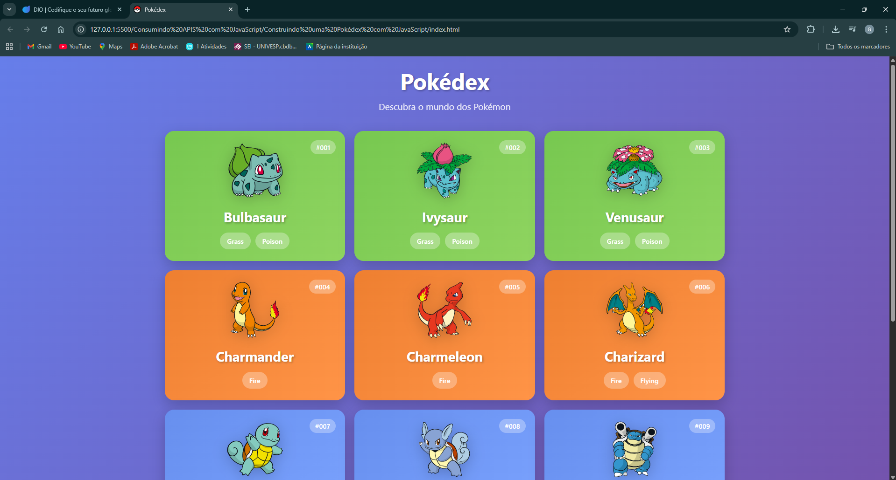

# 🛠️ Desafio de Projeto - Construindo uma Pokédex com JavaScript

Entenda a importância do Git/GitHub nos Desafios de Projeto da DIO, além de explorar o mundo Pokémon através do consumo de uma API REST para a criação de uma Pokédex incrível! Para isso, você irá explorar, além do JavaScript, todos os fundamentos de desenvolvimento Web aprendidos até aqui.

---

## 🎬 Resultado Final

🔗 [`Link do Arquivo`](./index.html)

Você pode conferir o resultado do projeto no vídeo abaixo:

📹 [`Desafio de Projeto - Construindo uma Pokédex com JavaScript`](../../public/midia/video/pokedex.mp4)

> Recomendado abrir em um navegador que suporte arquivos locais em vídeo.

---