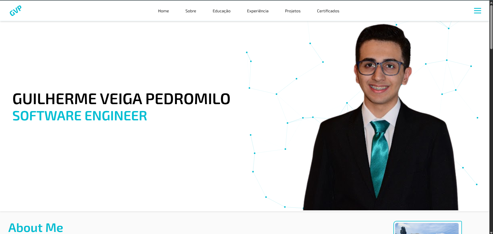

## 📡 Desafio de Projeto - Publicando Seu Portfólio Profissional no GitHub Pages

Explore todos os conceitos que aprendemos nessa imersão e replique (ou melhore, porque não) este projeto prático. Para isso, crie seu próprio repositório e, com isso, aumente ainda mais seu portfólio de projetos no GitHub! Lembre-se de que você pode criar sua própria estrutura JSON e deixar a sua página de portfólio profissional totalmente dinâmica e com a sua cara.

---

## 🎬 Resultado Final

🔗 [`Link do Repositório`](https://github.com/GuilhermeVeigaPedromilo/GuilhermeVeigaPedromilo)
🔗 [`Link do Portfólio`](https://guilhermeveigapedromilo.github.io/GuilhermeVeigaPedromilo/)

Você pode conferir o resultado do projeto no vídeo abaixo:

📹 [`Desafio de Projeto - Publicando Seu Portfólio Profissional no GitHub Pages`](../../public/midia/video/portfolio.mp4)

> Recomendado abrir em um navegador que suporte arquivos locais em vídeo.

---