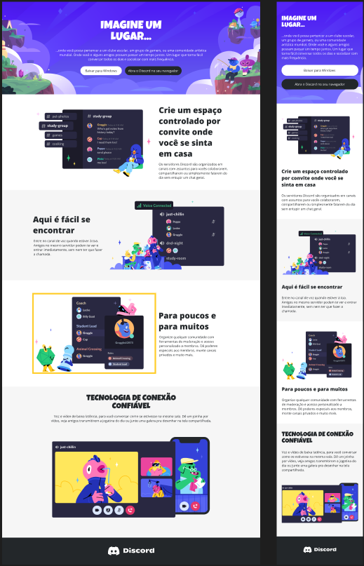

# 📲 Desafio de Projeto - Construindo um Layout Responsivo Para o Site do Discord Com CSS

Neste Desafio você colocará a mão na massa e irá reproduzir a página da incrível plataforma do Discord colocando em prática todos os conceitos aprendidos até aqui, principalmente sobre Responsividade no CSS.

---

## 🖼️ Template Proposto

Abaixo está a imagem do layout original disponibilizado como referência para o desafio:

---

## 🎬 Resultado Final

Você pode conferir o resultado do projeto no vídeo abaixo:

📹 [`Desafio de Projeto - Clonando a Página do Youtube com CSS`](../../public/midia/video/Desafio%20de%20Projeto%20-%20Construindo%20um%20Layout%20Responsivo%20Para%20o%20Site%20do%20Discord%20Com%20CSS.mp4)

> Recomendado abrir em um navegador que suporte arquivos locais em vídeo.

---