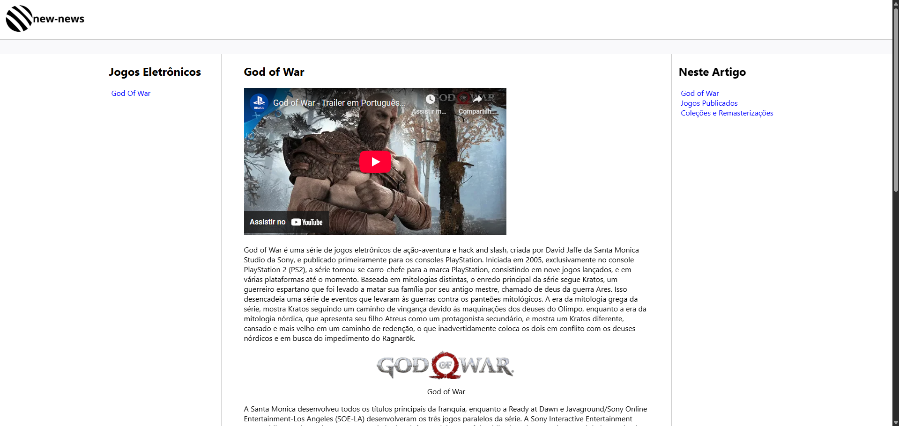

# 🔄 Desafio de Projeto - Recriando o Wikipedia com Layout Moderno

## 🧠 Entendendo o Desafio

Este desafio consiste em treinar você com relação a estrutura do site, e também aplicar conhecimentos adiquiridos sobre semântica e acessibilidade.

---

## 🎯 Resultado

- [📄 Acesse o Código por Aqui!](./desafio-de-projeto.html)

