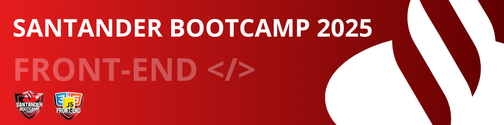
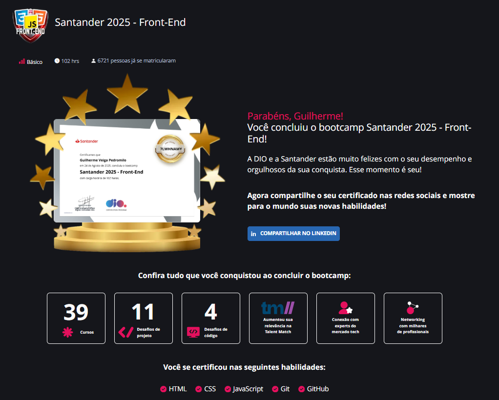

---

# Bootcamp - Santander 2025 Front-End

Domine a trinca fundamental do bom desenvolvedor Front-End com HTML, CSS e JAVASCRIPT, com uma base estruturada de conteúdos e 10 projetos práticos, incluindo páginas web responsivas e dinâmicas com temática do Stranger Things, Spider Man, Yu-Gi-Oh e mais! Estruture páginas web com HTML, estilize interfaces com CSS e conceitos avançados de Flexbox e Grid, implemente interatividade com JavaScript e trabalhar com APIs e requisições assíncronas. Estude e faça todas as atividades para de graduar e ganhar seu certificado!

## 🚀 Desafios de Projeto

### 🌐 Criar uma Página Web Utilizando as Tags Aprendidas
- A proposta deste desafio é desenvolver um website simples, utilizando as **tags HTML** aprendidas durante as aulas práticas. O objetivo é fixar o conhecimento por meio da prática!

- [📄 Acesse o Arquivo do Desafio aqui!](./Primeiros%20passos%20com%20HTML/Desafio%20de%20Projeto%20-%20Criando%20uma%20Página%20WEB/Criar%20Uma%20Página%20Web%20Utilizando%20as%20Tags%20Aprendidas.md)

### 🔄 Recriando o Wikipedia com Layout Moderno
- Este desafio consiste em treinar você com relação a estrutura do site, e também aplicar conhecimentos adiquiridos sobre semântica e acessibilidade.

- [📄 Acesse o Arquivo do Desafio aqui!](./Primeiros%20passos%20com%20HTML/Desafio%20de%20Projeto%20-%20Recriando%20o%20Wikipedia%20com%20Layout%20Moderno/Recriando%20o%20Wikipedia%20com%20Layout%20Moderno.md)

### 💻 Criando sua primeira Landing Page com HTML e CSS
- Este desafio consiste em construir uma Landing Page com HTML e CSS, colocando em prática os fundamentos do CSS,
as propriedades básicas da linguagem de estilização, além de trabalhar com as unidades de medidas relativas e absolutas que aprendemos ao longo da trilha.

- [📄 Acesse o Arquivo do Desafio aqui!](./Explorando%20os%20Fundamentos%20do%20CSS/Criando%20sua%20Primeira%20Landing%20Page%20com%20HTML%20e%20CSS/README.md)

### 📺 Clonando a Página do YouTube com CSS

- O objetivo do desafio era recriar a interface do YouTube com base em um template fornecido, utilizando **HTML5** e **CSS3**, com foco na aplicação de boas práticas de **semântica**, **posicionamento**, **responsividade** e **estilização**.

- [📄 Acesse o Arquivo do Desafio aqui!](./Posicionamento%20de%20Elementos%20com%20CSS/Desafio%20de%20Projeto%20-%20Clonando%20a%20Página%20do%20Youtube%20com%20CSS/desafio-de-projeto-clonando-a-pagina-do-youtube-com-css.md)

### 📲 Desafio de Projeto - Construindo um Layout Responsivo Para o Site do Discord Com CSS

- Neste Desafio você colocará a mão na massa e irá reproduzir a página da incrível plataforma do Discord colocando em prática todos os conceitos aprendidos até aqui, principalmente sobre Responsividade no CSS.

- [📄 Acesse o Arquivo do Desafio aqui!](./Posicionamento%20de%20Elementos%20com%20CSS/Construindo%20um%20Layout%20Responsivo%20Para%20o%20Site%20do%20Discord%20Com%20CSS/readme.md)

### 🗞️ Desafio de Projeto - Classificador de Nível de Herói

- Este desafio consiste em criar uma variável para armazenar o nome e a quantidade de experiência (XP) de um herói, depois utilizar uma estrutura de decisão para apresentar uma mensagem.

- [📄 Acesse o Arquivo do Desafio aqui!](./Lógica%20Aplicada%20com%20Javascript/Classificador%20de%20Nível%20de%20Herói/readme.md)

### 💼 Desafio de Projeto - Construindo seu Portfólio Front-end do Zero com HTML, CSS e JavaScript

 - Este projeto tem como objetivo desenvolver um portfólio front-end. Sinta-se livre para utilizar as tecnologias que desejar e expressar sua personalidade e estilo através do design e dos elementos interativos do seu portfólio. Após concluir, você pode hospedá-lo em uma plataforma de sua escolha, como GitHub Pages, Netlify, Vercel, etc.

- [📄 Acesse o Arquivo do Desafio aqui!](./Seus%20Primeiros%20Passos%20com%20JavaScript/Construindo%20seu%20Portfólio%20Front-end%20do%20Zero%20com%20HTML,%20CSS%20e%20JavaScript/readme.md)
- [🔗  Acesse o Portfólio Aqui!](https://guilhermeveigapedromilo.github.io/GuilhermeVeigaPedromilo/)

### 🛠️ Desafio de Projeto - Construindo uma Pokédex com JavaScript

- Entenda a importância do Git/GitHub nos Desafios de Projeto da DIO, além de explorar o mundo Pokémon através do consumo de uma API REST para a criação de uma Pokédex incrível! Para isso, você irá explorar, além do JavaScript, todos os fundamentos de desenvolvimento Web aprendidos até aqui.

- [📄 Acesse o Arquivo do Desafio aqui!](./Consumindo%20APIS%20com%20JavaScript/Construindo%20uma%20Pokédex%20com%20JavaScript/README.MD)

### 🕹️ Desafio de Projeto - Criando um Jogo de Cartas do Yu-Gi-Oh! com JavaScript e CSS

- Vamos recriar um jogo do Yu-Gi-Oh utilizando as mecânicas de jogo do Jo-Ken-Po, vamos explorar conceitos avançados de organização de states com Javascript puro, estruturação de arquivos e criação de funções reaproveitáveis

- [📄 Acesse o Arquivo do Desafio aqui!](./Criando%20Páginas%20Web%20Dinâmicas%20e%20Interativas/Criando%20um%20Jogo%20de%20Cartas%20do%20YuGiOh%20com%20JavaScript%20e%20CSS/readme.md)

### 📡 Desafio de Projeto - Publicando Seu Portfólio Profissional no GitHub Pages

- Explore todos os conceitos que aprendemos nessa imersão e replique (ou melhore, porque não) este projeto prático. Para isso, crie seu próprio repositório e, com isso, aumente ainda mais seu portfólio de projetos no GitHub! Lembre-se de que você pode criar sua própria estrutura JSON e deixar a sua página de portfólio profissional totalmente dinâmica e com a sua cara.

- [📄 Acesse o Arquivo do Desafio aqui!](./Criando%20Páginas%20Web%20Dinâmicas%20e%20Interativas/Publicando%20Seu%20Portfólio%20Profissional%20no%20GitHub%20Pages/readme.md)
- [🔗  Acesse o Portfólio Aqui!](https://guilhermeveigapedromilo.github.io/GuilhermeVeigaPedromilo/)

## 🎯 Resultados

---