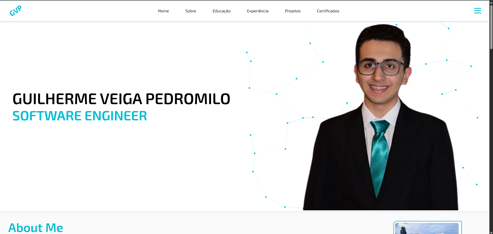

# 💼 Desafio de Projeto - Construindo seu Portfólio Front-end do Zero com HTML, CSS e JavaScript

Este projeto tem como objetivo desenvolver um portfólio front-end. Sinta-se livre para utilizar as tecnologias que desejar e expressar sua personalidade e estilo através do design e dos elementos interativos do seu portfólio. Após concluir, você pode hospedá-lo em uma plataforma de sua escolha, como GitHub Pages, Netlify, Vercel, etc.

---

## 🎬 Resultado Final

 🔗 [`Link do Repositório`](https://github.com/GuilhermeVeigaPedromilo/GuilhermeVeigaPedromilo)
 🔗 [`Link do Portfólio`](https://guilhermeveigapedromilo.github.io/GuilhermeVeigaPedromilo/)

Você pode conferir o resultado do projeto no vídeo abaixo:

 📹 [`Desafio de Projeto - Construindo seu Portfólio Front-end do Zero com HTML, CSS e JavaScript`](../../public/midia/video/portfolio.mp4)

> Recomendado abrir em um navegador que suporte arquivos locais em vídeo.

---